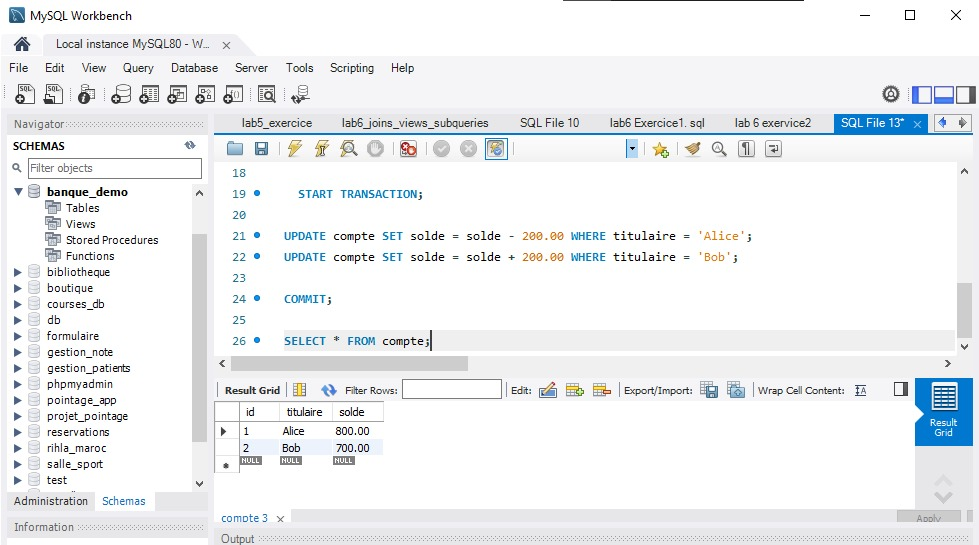
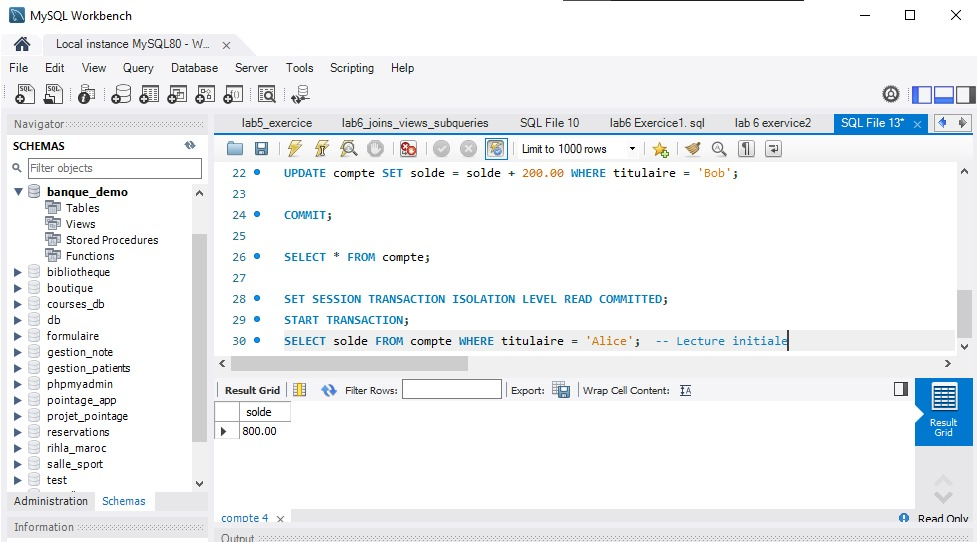
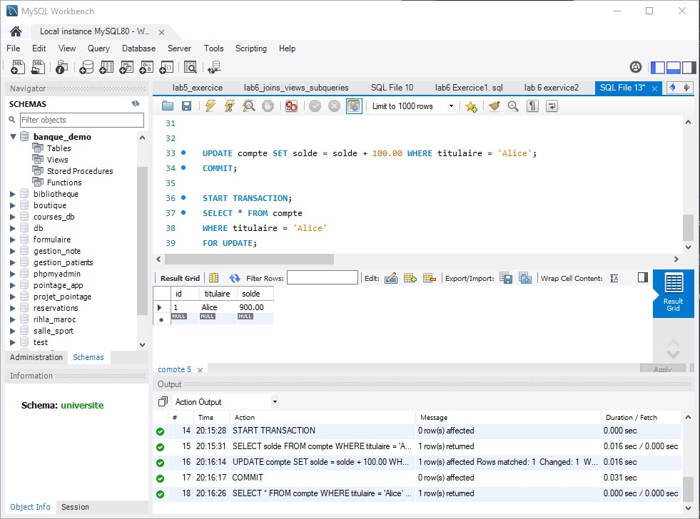

# Lab 7 — Transactions, Verrouillage et Sécurité 

## 🎯 Objectif
Comprendre et mettre en pratique :
- les transactions (`START TRANSACTION`, `COMMIT`, `ROLLBACK`)
- les niveaux d’isolation
- les verrous (locks)
- la gestion des utilisateurs et des privilèges

## 🗄️ Contexte
Base de démonstration : `banque_demo`  
Table principale : `compte(id, titulaire, solde)`

## 📁 Livrable
- `lab7_transactions_securite.sql` : script complet avec transactions, locks et sécurité
- Captures montrant :
  - le blocage d’une session lors d’un verrou
  - le refus d’une opération non autorisée


#### Résultat visuel

<div align="center">  <p><em>Figure 1</em></p> </div>


<div align="center">  <p><em>Figure 2</em></p> </div>


<div align="center">  <p><em>Figure 3</em></p> </div>


<div align="center">  <p><em>Figure 4</em></p> </div>


## ▶️ Exécution
En ligne de commande :
```bash
mysql -u root -p < lab7_transactions_securite.sql
